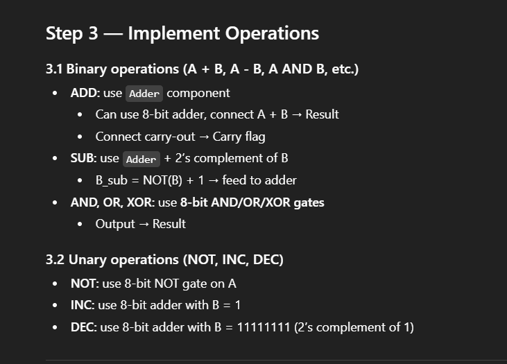
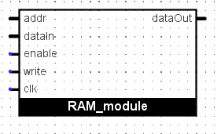
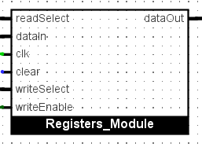
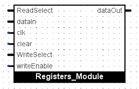

# 8-bit CPU
A Von Neumann architecture 8-bit CPU.  
**Instruction format:** [5-bit opcode, 8-bit operand]  

---

## Registers

| Register | Encoding | Description |
|----------|-----------------------------|-------------|
| Wreg     | Standalone                  | working register  |
| PC       | Standalone                  | program counter   |
| R0       | 00000000                    | general-purpose 0 |
| R1       | 00000001                    | general-purpose 1 |
| R2       | 00000010                    | general-purpose 2 |
| R3       | 00000011                    | general-purpose 3 |
| R4       | 00000100                    | general-purpose 4 |
| SP       | 00000101                    | stack pointer |
| MD       | 00000110                    | memory data |
| MA       | 00000111                    | memory address |

---

## ISA

### Data commands

| Instruction       | Opcode (5-bit) | Operand (8-bit) | Description |
|------------------|----------------|----------------|-------------|
| `NOP`            | 00000          | –              | no operation |
| `LOADI Wreg imm` | 00001          | 8-bit immediate | load immediate into Wreg |
| `LOADA Wreg [addr]` | 00010      | 8-bit address  | load from memory to Wreg |
| `STORE Wreg [addr]` | 00011      | 8-bit address  | store Wreg to memory |
| `MOV Wreg Rn`   | 00100          | register code  | move Rn to Wreg |
| `MOVW Rn Wreg`  | 00101          | register code  | move Wreg to Rn |
| `SET Wreg`      | 00110          | –              | loadi Wreg with 0xFF |
| `CLEAR Wreg`       | 00111          | –              | loadi Wreg with 0x00 |

### ALU commands

| Instruction       | Opcode (5-bit) | Operand (8-bit) | Description |
|------------------|----------------|----------------|-------------|
| `ADD Wreg Rn`   | 01000          | register code  | add Rn to Wreg |
| `SUB Wreg Rn`   | 01001          | register code  | subtract Rn from Wreg |
| `AND Wreg Rn`   | 01010          | register code  | AND Rn with Wreg |
| `OR Wreg Rn`    | 01011          | register code  | OR Rn with Wreg |
| `XOR Wreg Rn`   | 01100          | register code  | XOR Rn with Wreg |
| `NOT Wreg`       | 01101          | –              | invert Wreg |
| `INC Wreg`       | 01110          | –              | increment Wreg |
| `DEC Wreg`       | 01111          | –              | decrement Wreg |

### jump commands

| Instruction       | Opcode (5-bit) | Operand (8-bit) | Description |
|------------------|----------------|----------------|-------------|
| `JMP [addr]`     | 10000          | 8-bit address  | jump to address |
| `JZ [addr]`      | 10001          | 8-bit address  | jump if zero |
| `JC [addr]`      | 10010          | 8-bit address  | jump if carry |
| `HLT`            | 10011          | –              | halt CPU |

### I/O

| Instruction        | Opcode (5-bit) | Operand (8-bit)| Description |
|--------------------|----------------|----------------|-------------|
| `IN Wreg`          | 10100          | –              | read byte into Wreg |
| `OUT Wreg imm`     | 10101          | 8 bit immediate(row value)| write Wreg to output|

## ALU  
Handles everything that is in the ALU commands section.  

- INPUTS
    - ALU OP 2-1-0
    - Wreg  
    - Rn
- OUTPUTS
    - Result (8 bit, goes to data bus)
    - carryF  
    - zeroF

## ROM  
Program memory containing all the code, 256 addresses aka 256 instructions can be loaded.  

- INPUTS
    - addr (8 bits)
- OUTPUTS
    - data (8 bits, go to data bus)  
    
## RAM  
Memory that can be used to store values, 256 addresses 

  
- INPUTS
    - addr   (8 bits)
    - dataIn (8 bits)  
    - readEnable  (enables reading from addr)
    - writeEnable (enables writing dataIn to addr) 
    - clk  
- OUTPUTS
    - dataOut (8 bit, goes to data bus)

## REGISTERS  
Contains all registers except  PC and Wreg being standalones.

- INPUTS
    - dataIn (8 bits)  
    - writeSelect (3 bits)
    - writeEnable 
    - readSelect (3 bits)
    - clk  
    - clear
- OUTPUTS
    - dataOut (8 bit, goes to data bus)  

## CONTROL UNIT
  
- INPUTS
    - opcode (5 bits, 5 MSB of the instruction)
    - operand (8 bits, 8 LSB of the instruction)  
    - clk  
    - zeroF  
    - carryF  
- OUTPUTS    
    - Wreg_WE  
    - Wreg_RE  
    - REG_WE  
    - REG_SEL (3 bits)  
    - RAM_RE  
    - RAM_WE  
    - RAM_ADDR_EN  
    - ALU_OP (3 bits)  
    - ALU_EN  
    - PC_LOAD  
    - PC_EN  
    - ROM_TO_DATABUS  
    - RN_TO_DATABUS  
    - IN_TO_DATABUS  
    - OUT_EN  
    - HALT      
  
#### DATA COMMAND SIGNALS
| Instruction | Wreg_WE | Wreg_RE | REG_WE | REG_SEL | RAM_RE | RAM_WE | RAM_ADDR_EN | ALU_OP | ALU_EN | PC_LOAD | PC_EN | ROM_TO_DATABUS | RN_TO_DATABUS | IN_TO_DATABUS | OUT_EN | HALT |
| ----------- | ------- | ------- | ------ | ------- | ------ | ------ | ----------- | ------ | ------ | ------- | ----- | ------ | ------ | -------- | -------- | ---- |
| NOP         | 0       | 0       | 0      | –       | 0      | 0      | 0           | –      | 0      | 0       | 1     | 0      | 0      | 0        | 0        | 0    |
| LOADI       | 1       | 0       | 0      | –       | 0      | 0      | 0           | –      | 0      | 0       | 1     | 1      | 0      | 0        | 0        | 0    |
| LOADA       | 1       | 0       | 0      | –       | 1      | 0      | 1           | –      | 0      | 0       | 1     | 0      | 0      | 0        | 0        | 0    |
| STORE       | 0       | 1       | 0      | –       | 0      | 1      | 1           | –      | 0      | 0       | 1     | 0      | 0      | 0        | 0        | 0    |
| MOV W Rn    | 1       | 0       | 0      | Rn      | 0      | 0      | 0           | –      | 0      | 0       | 1     | 0      | 0      | 0        | 0        | 0    |
| MOVW Rn W   | 0       | 1       | 1      | Rn      | 0      | 0      | 0           | –      | 0      | 0       | 1     | 0      | 0      | 0        | 0        | 0    |
| SET         | 1       | 0       | 0      | –       | 0      | 0      | 0           | –      | 0      | 0       | 1     | 0      | 0      | 0        | 0        | 0    |
| CLEAR       | 1       | 0       | 0      | –       | 0      | 0      | 0           | –      | 0      | 0       | 1     | 0      | 0      | 0        | 0        | 0    |

#### ALU COMMAND SIGNALS  
| Instruction | Wreg_WE | Wreg_RE | REG_WE | REG_SEL | RAM_RE | RAM_WE | RAM_ADDR_EN | ALU_OP | ALU_EN | PC_LOAD | PC_EN | ROM_TO_DATABUS | RN_TO_DATABUS | IN_TO_DATABUS | OUT_EN | HALT |
| ----------- | ------- | ------- | ------ | ------- | ------ | ------ | ----------- | ------ | ------ | ------- | ----- | ------ | ------ | -------- | -------- | ---- |
| ADD W Rn    | 1       | 0       | 0      | Rn      | 0      | 0      | 0           | 000    | 1      | 0       | 1     | 0      | 0      | 0        | 0        | 0    |
| SUB W Rn    | 1       | 0       | 0      | Rn      | 0      | 0      | 0           | 001    | 1      | 0       | 1     | 0      | 0      | 0        | 0        | 0    |
| AND W Rn    | 1       | 0       | 0      | Rn      | 0      | 0      | 0           | 010    | 1      | 0       | 1     | 0      | 0      | 0        | 0        | 0    |
| OR W Rn     | 1       | 0       | 0      | Rn      | 0      | 0      | 0           | 011    | 1      | 0       | 1     | 0      | 0      | 0        | 0        | 0    |
| XOR W Rn    | 1       | 0       | 0      | Rn      | 0      | 0      | 0           | 100    | 1      | 0       | 1     | 0      | 0      | 0        | 0        | 0    |
| NOT W       | 1       | 0       | 0      | –       | 0      | 0      | 0           | 101    | 1      | 0       | 1     | 0      | 0      | 0        | 0        | 0    |
| INC W       | 1       | 0       | 0      | –       | 0      | 0      | 0           | 110    | 1      | 0       | 1     | 0      | 0      | 0        | 0        | 0    |
| DEC W       | 1       | 0       | 0      | –       | 0      | 0      | 0           | 111    | 1      | 0       | 1     | 0      | 0      | 0        | 0        | 0    |

#### JUMP COMMAND SIGNALS 
| Instruction | Wreg_WE | Wreg_RE | REG_WE | REG_SEL | RAM_RE | RAM_WE | RAM_ADDR_EN | ALU_OP | ALU_EN | PC_LOAD       | PC_EN | ROM_TO_DATABUS | RN_TO_DATABUS | IN_TO_DATABUS | OUT_EN | HALT |
| ----------- | ------- | ------- | ------ | ------- | ------ | ------ | ----------- | ------ | ------ | ------------- | ----- | ------ | ------ | -------- | -------- | ---- |
| JMP addr    | 0       | 0       | 0      | –       | 0      | 0      | 0           | –      | 0      | 1             | 0     | 1      | 0      | 0        | 0        | 0    |
| JZ addr     | 0       | 0       | 0      | –       | 0      | 0      | 0           | –      | 0      | 1 if zeroF=1  | 0     | 1      | 0      | 0        | 0        | 0    |
| JC addr     | 0       | 0       | 0      | –       | 0      | 0      | 0           | –      | 0      | 1 if carryF=1 | 0     | 1      | 0      | 0        | 0        | 0    |
| HLT         | 0       | 0       | 0      | –       | 0      | 0      | 0           | –      | 0      | 0             | 0     | 0      | 0      | 0        | 0        | 1    |

#### I/0 Instructions
| Instruction | Wreg_WE | Wreg_RE | REG_WE | REG_SEL | RAM_RE | RAM_WE | RAM_ADDR_EN | ALU_OP | ALU_EN | PC_LOAD       | PC_EN | ROM_TO_DATABUS | RN_TO_DATABUS | IN_TO_DATABUS | OUT_EN | HALT |
| ----------- | ------- | ------- | ------ | ------- | ------ | ------ | ----------- | ------ | ------ | ------------- | ----- | ------ | ------ | -------- | -------- | ---- |
| IN Wreg    | 1       | 0       | 0      | –       | 0      | 0      | 0           | –      | 0      | 0            | 0     | 0      | 0      | 1        | 0        | 0    |
| OUT Wreg imm     | 0       | 1       | 0      | –       | 0      | 0      | 0           | –      | 0      |0  | 0     | 0      | 0      | 0        | 1        | 0    |